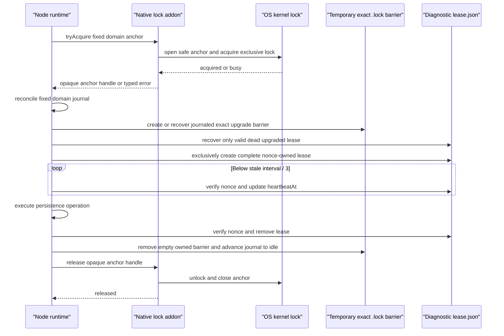

# TokenGraph Phase 3 Native Lock Addon Design

Date: 2026-08-09

Status: amended design approved 2026-08-10

## Context

Phase 3 replaces stale-mtime persistence locks with ownership-safe leases. A
Node-only implementation was tested on Windows with six concurrent stale-lock
claimers. Two callers received successful `rename` results for the same owner
directory, and the first claimant then observed its claimed owner as missing.
That violates the required single-owner transition and triggers the plan's
explicit filesystem-reliability stop.

The failed Node-only implementation remains preserved as evidence. It must not
be merged or used as a fallback.

This design is the documented response to the plan's filesystem-reliability
stop condition. The original exclusive-create, double-read stale recovery, and
nonce-checked deletion steps remain the diagnostic lease behavior, but they no
longer establish ownership or authorize lock breaking. Kernel ownership replaces
that unsafe transition; the approved implementation does not silently claim the
failed filesystem state machine met the original premise.

## Requirements

The replacement must:

1. Provide cross-process mutual exclusion on supported local filesystems.
2. Release ownership automatically when the TokenGraph process exits normally
   or unexpectedly, without an independently failing lock-holder process.
3. Retain the versioned diagnostic lease contract
   `{schemaVersion,pid,nonce,startedAt,heartbeatAt}`.
4. Keep heartbeats below one third of the stale interval and verify the nonce
   before changing diagnostic state.
5. Never delete or overwrite state owned by a different nonce or recorded
   identity. The only exception is the approved reserved-transaction authority:
   before an identity can be durably recorded, one exact protocol-reserved
   provisional object may be recovered under the closed rules below.
6. Treat malformed, partial, linked, or otherwise ambiguous state as occupied
   or degraded, never as permission to break a live lock.
7. Preserve root confinement, canonical lock keys, restrictive permissions,
   same-process serialization, and operation-plus-cleanup `AggregateError`
   behavior.
8. Work without a compiler or dependency installation on the end-user machine.
9. Fail closed when the required addon is missing, modified, unsupported, or
   ABI-incompatible. There is no stale-mtime or Node-only fallback.
10. Remain best-effort on network filesystems; no distributed-lock guarantee is
    introduced.
11. Refuse every v2 lock operation until that process receives explicit
    confirmation that all v0.23.1 MCP/CLI processes are stopped. Concurrent
    mixed-runtime operation is unsupported.

## Selected Architecture

TokenGraph will bundle a small Node-API native addon for each supported platform
and architecture. The addon acquires a kernel lock in the TokenGraph process for
the full JavaScript operation:

- Windows: `LockFileEx` on a regular lock-anchor file.
- POSIX: nonblocking exclusive `flock` on a regular lock-anchor file.

The kernel lock is authoritative between upgraded runtimes. Each allowlisted
persistence domain contains one fixed, persistent native anchor named
`.tokengraph-native-anchor-v2.lock` and one bounded recovery journal named
`.tokengraph-native-journal-v2.lock`; all lock keys in that domain intentionally
serialize on its anchor. The exact legacy `.lock` path becomes a temporary,
restrictively owned directory containing diagnostic `lease.json` only while the
operation is owned. That temporary nonempty directory is the upgrade barrier
against stale old lock files and accidental same-key downgrade attempts. It is
not claimed as protection from a concurrently running old cleanup routine;
mixed-runtime concurrency is prohibited by the rollout boundary below.

This domain-scoped anchor avoids one permanent filesystem object per unbounded
`runId`, `taskId`, or artifact hash. Different registered domains can overlap;
keys in the same domain trade concurrency for bounded persistent state. The
fixed journal permits at most one unresolved upgraded compatibility barrier in
that domain and is reconciled before a new key can start. The addon runs
in-process deliberately: if native code crashes, the TokenGraph process and its
protected callback stop before the operating system releases the lock. A
sidecar process is rejected because its independent crash could release
ownership while JavaScript continued writing.

Atomic journal and lease replacement uses exactly two additional provisional
names: `.tokengraph-native-journal-v2.lock.tokengraph-write-v2.tmp` in the
domain root and `lease.json.tokengraph-write-v2.tmp` inside the sole
journal-identified compatibility directory. These names are reserved protocol
infrastructure, not user data. At most one of each may exist per domain, and
neither is adopted merely because its bytes resemble expected state.



If Node exits normally, `finally` removes its empty barrier and releases the
handle. If Node terminates, panics in native code, or crashes, the operating
system closes the process handle or descriptor and releases the kernel lock.
The exact barrier and `lease.json` can remain after a crash, but the next
upgraded runtime may recover only a valid, unchanged, stale lease whose PID is
confirmed dead. There is no independent lock-holder whose lifetime can diverge
from the protected callback.

## Supported Targets

The installable plugin contains one addon for each supported target:

| Node platform/architecture | Rust target | Release file |
|---|---|---|
| `win32/x64` | `x86_64-pc-windows-msvc` | `tokengraph-lock.win32-x64.node` |
| `win32/arm64` | `aarch64-pc-windows-msvc` | `tokengraph-lock.win32-arm64.node` |
| `linux/x64` | `x86_64-unknown-linux-gnu` | `tokengraph-lock.linux-x64.node` |
| `linux/arm64` | `aarch64-unknown-linux-gnu` | `tokengraph-lock.linux-arm64.node` |
| `darwin/x64` | `x86_64-apple-darwin` | `tokengraph-lock.darwin-x64.node` |
| `darwin/arm64` | `aarch64-apple-darwin` | `tokengraph-lock.darwin-arm64.node` |

All addons target Node-API version 9, which is within the repository's Node
`>=22` runtime contract. CI includes the minimum supported Node major and the
current Node major. Unsupported platform/architecture or Node-API pairs return a
precise fail-closed error. They never select a nearby binary or fall back to
stale-file deletion.

The operating-system floors match Node 22's supported platforms: Linux kernel
4.18 with glibc 2.28 for x64 and arm64, Windows 10 (or Server 2016 for x64), and
macOS 11.0. Older or musl-based systems are unsupported rather than receiving an
unverified fallback. The authoritative baseline is the
[Node 22 supported-platform table](https://github.com/nodejs/node/blob/v22.x/BUILDING.md#platform-list).

## Source and Package Layout

```text
plugins/tokengraph/
  native/lock-addon/
    Cargo.toml
    Cargo.lock
    src/lib.rs
  assets/native-lock/
    manifest.json
    win32-x64/tokengraph-lock.win32-x64.node
    win32-arm64/tokengraph-lock.win32-arm64.node
    linux-x64/tokengraph-lock.linux-x64.node
    linux-arm64/tokengraph-lock.linux-arm64.node
    darwin-x64/tokengraph-lock.darwin-x64.node
    darwin-arm64/tokengraph-lock.darwin-arm64.node
  src/core/nativeLockAddon.ts
  src/core/storage.ts
  scripts/build-native-lock-addon.mjs
  scripts/validate-native-lock-addon.mjs
```

`release/tokengraph/` remains generated. `package-plugin.mjs` copies the
validated addon manifest and binaries from source assets. Release files are
never edited directly.

## Addon Contract

The addon exposes the smallest possible synchronous Node-API surface:

```ts
interface NativeLockAddon {
  readonly abiVersion: 1;
  readonly implementation: "lockfileex" | "flock";
  tryAcquireAnchor(anchorPath: string): NativeLockHandle;
}

interface NativeLockHandle {
  protectCompatibilityDirectory(lockPath: string): void;
  releaseCompatibilityDirectory(): void;
  release(): void;
}
```

`tryAcquireAnchor` is nonblocking. It either returns one opaque handle or throws
a typed, stable error such as `LOCK_BUSY`, `UNSAFE_ANCHOR`, or
`NATIVE_LOCK_ERROR`. Errors expose no absolute path.

After JavaScript creates and validates the exact temporary barrier,
`protectCompatibilityDirectory` opens that directory without following links
and retains its identity. On Windows the retained handle denies delete sharing;
on POSIX it supports descriptor-versus-entry identity checks under the
cooperative contract. `releaseCompatibilityDirectory` closes only that barrier
handle while retaining the authoritative anchor so JavaScript can remove its
empty owned directory before final native unlock.

The handle cannot be constructed or cloned by JavaScript. Compatibility protect
and release occur at most once in order, and anchor release happens exactly
once. Invalid transitions return typed state errors.

The handle owns the native anchor handle or descriptor plus the protected
compatibility-directory handle. On Windows it also owns the complete
no-delete-share directory-handle chain opened during anchor validation; those
handles remain live for the full JavaScript critical section and close only
after unlock/close. A Node-API finalizer is a last-resort close for abandoned
handles, but normal correctness never depends on garbage collection:
`withFileLock` explicitly releases the compatibility handle and anchor in
`finally`. No user callback, heartbeat, recursive cleanup, or JSON parsing
executes in native code.

## Lock Domain Registry

Production code cannot derive an anchor from an arbitrary `dirname(lockPath)`.
It constructs a branded `CanonicalPersistenceLock` through a closed
`LockDomain` registry:

```ts
type LockDomain =
  | "workspace-state"
  | "repository-state"
  | "runs"
  | "tasks"
  | "vault"
  | "wiki"
  | "artifacts"
  | "git-info";

interface CanonicalPersistenceLock {
  readonly domain: LockDomain;
  readonly domainRoot: string;
  readonly compatibilityPath: string;
  readonly anchorPath: string;
  readonly journalPath: string;
}

declare function canonicalPersistenceLock(
  workspaceRoot: string,
  domain: LockDomain,
  relativeDataName: string
): Promise<CanonicalPersistenceLock>;
```

The initial production inventory is finite and explicit:

| Domain | Canonical domain root | Current lock consumers |
|---|---|---|
| `workspace-state` | `<workspace>/.tokengraph` | config, review queue, worktree index |
| `repository-state` | `<workspace>/.tokengraph/repository` | repository identity and migration, memory, rules, routing control |
| `runs` | `<workspace>/.tokengraph/runs` | per-run records |
| `tasks` | `<workspace>/.tokengraph/tasks` | per-task records and completed outcomes |
| `vault` | `<workspace>/.tokengraph/vault` | vault manifest and projection |
| `wiki` | `<workspace>/.tokengraph/wiki` | wiki manifest and pages |
| `artifacts` | `<workspace>/.tokengraph/repository/artifacts` | stable artifacts |
| `git-info` | resolved Git common directory `info` | `exclude` updates |

The constructor derives `domainRoot` from the workspace and domain; callers do
not supply it. `relativeDataName` is one safe filename segment, so the exact
legacy compatibility path is `join(domainRoot, relativeDataName + ".lock")`.
The constructor validates canonical confinement and, for `git-info`, derives
the resolved Git common directory itself. It rejects unknown domains, dynamic
parent directories, separators or traversal in the relative name, raw-cast
branded values, and paths outside the registered root. Stores that currently
receive only an arbitrary file path must be refactored to receive the branded
lock or its workspace/domain inputs; they cannot reconstruct a domain from that
path.

A static caller inventory test fails whenever a production `withFileLock` call
is not routed through this constructor. A cardinality test asserts that one
workspace can create no more than these eight domain anchors, subject only to
the one resolved Git common directory belonging to that workspace.

Each domain root contains the fixed `.tokengraph-native-anchor-v2.lock` and
`.tokengraph-native-journal-v2.lock`. Infrastructure names end in `.lock` for
legacy enumeration compatibility, but v2 explicitly excludes them from quota
accounting, migration, export, reset reports, and ordinary data enumeration.
The journal holds either an idle record or one complete active/recovery record.
Schema version 2 makes every provisional barrier or lease replacement an
explicit, generation-ordered transaction:

```ts
interface PendingBarrierV2 {
  readonly operation: "create";
}

interface PendingLeaseWriteV2 {
  readonly operation: "create" | "replace";
  readonly fromIdentity?: string;
  readonly payloadSha256: string;
  readonly temporaryIdentity?: string;
}

interface JournalPredecessorV2 {
  readonly generation: number;
  readonly identity: string;
}

interface IdleLockRecoveryJournalV2 {
  readonly schemaVersion: 2;
  readonly generation: number;
  readonly phase: "idle";
  readonly predecessor?: JournalPredecessorV2;
}

interface ActiveLockRecoveryJournalV2 {
  readonly schemaVersion: 2;
  readonly generation: number;
  readonly predecessor: JournalPredecessorV2;
  readonly relativeLegacyName: string;
  readonly keyHash: string;
  readonly pid: number;
  readonly nonce: string;
  readonly phase: "intent" | "barrier-created" | "lease-created" | "cleanup";
  readonly startedAt: string;
  readonly heartbeatAt: string;
  readonly barrierIdentity?: string;
  readonly leaseIdentity?: string;
  readonly pendingBarrier?: PendingBarrierV2;
  readonly pendingLeaseWrite?: PendingLeaseWriteV2;
}

type LockRecoveryJournalV2 =
  | IdleLockRecoveryJournalV2
  | ActiveLockRecoveryJournalV2;
```

`generation` is a nonnegative safe integer and increases by exactly one. The
generation-zero bootstrap is exactly
`{schemaVersion:2,generation:0,phase:"idle"}` with no other key. A later idle
generation contains only those three fields plus `predecessor`. It is neutral:
it carries no owner PID, nonce, timestamps, lock key, barrier/lease identity, or
pending transition and is reusable regardless of the process that wrote the
preceding active generation.

The phase cross-product is closed:

- `idle` has no active-owner or lock-state field; generation zero has no
  predecessor, and every later idle generation has exactly one predecessor;
- `intent` has no barrier or lease identity and requires exactly
  `pendingBarrier`;
- `barrier-created` requires `barrierIdentity`, forbids `leaseIdentity` and
  `pendingBarrier`, and may have only a create-form `pendingLeaseWrite` with no
  `fromIdentity`;
- `lease-created` requires both identities, forbids `pendingBarrier`, and may
  have only a replace-form `pendingLeaseWrite` whose `fromIdentity` exactly
  equals `leaseIdentity`;
- `cleanup` requires `barrierIdentity`, permits the recorded `leaseIdentity`
  only until that lease is removed, and forbids both pending fields.

The pending fields are mutually exclusive. `temporaryIdentity` is absent until
the flushed temporary has been stably reread. Every other field/phase
combination fails closed before mutation. Every valid generation implicitly
authorizes only the fixed journal temporary as its possible
generation-plus-one successor; it does not authorize any other root entry.
Every generation above zero requires `predecessor.generation === generation -
1` and binds `predecessor.identity` to the exact stable journal target replaced
by that generation.

The predecessor-to-successor generation matrix is closed. `G -> G+1` below
always requires that exact predecessor binding and the same journal path/domain.
Within an active operation, `relativeLegacyName`, `keyHash`, PID, nonce, and
`startedAt` remain byte-identical and `heartbeatAt` never decreases. Only
neutral-idle to intent creates a new owner/key/nonce tuple. All unlisted pairs
fail before a journal temporary can be renamed.

| Predecessor at generation G | Allowed successor at G+1 | Additional authority |
|---|---|---|
| neutral `idle` | `intent` plus `pendingBarrier` | start one new operation with current PID, new nonce, canonical equal start/heartbeat timestamps, and one key in this domain |
| `intent` plus `pendingBarrier` | `barrier-created` with exact `barrierIdentity` and no pending field | the normal still-live same-process writer with its in-memory transition receipt exclusively created the path, or stale/dead recovery adopted the exact safe existing authorized directory; stale/dead path-absent recovery cannot take this row |
| `intent` plus `pendingBarrier` | neutral `idle` | active owner is stale/dead and the exact path is absent; this rollback is mandatory and recovery never retries or creates the dead callback's barrier |
| `barrier-created` with no lease/pending | same phase plus create-form `pendingLeaseWrite` without `temporaryIdentity` | only the still-live same-process callback that created the barrier for its current operation and retains its in-memory transition receipt; target is absent and proposed payload preserves active owner/key/nonce |
| `barrier-created` with no lease/pending | barrier-only `cleanup` retaining the exact `barrierIdentity` | active owner is stale/dead and the recorded barrier is unchanged, safely empty, and stable; this teardown-only row is mandatory, including after stale/dead intent adoption, and recovery never initiates lease creation for the dead callback |
| pending create without temporary identity | same pending create with recorded `temporaryIdentity` | exact temporary was flushed and stably reread |
| either pending-create shape | `barrier-created` with no pending | exact authorized temporary is absent or was removed and lease target is absent |
| pending create with recorded temporary identity | `lease-created` with that exact new `leaseIdentity` and no pending | authorized rename/parent flush/finalization completed |
| `lease-created` with no pending | same phase plus replace-form `pendingLeaseWrite`, `fromIdentity` equal to current `leaseIdentity`, and no `temporaryIdentity` | only the still-live same-process heartbeat holding its in-memory transition receipt may begin this replacement path |
| pending replace without temporary identity | same pending replace with recorded `temporaryIdentity` | exact temporary was flushed and stably reread |
| either pending-replace shape | prior `lease-created` with no pending | old target identity and heartbeat are unchanged and exact temporary is absent or was removed |
| pending replace with recorded temporary identity | `lease-created` with exact new `leaseIdentity`, replacement heartbeat, and no pending | authorized rename/parent flush/finalization completed; heartbeat is monotonic |
| `lease-created` with no pending | `cleanup` retaining exact barrier and lease identities | the live same-process operation/heartbeat has stopped, or stale/dead recovery has resolved any already-pending replacement and finds the recorded barrier and lease unchanged; recovery never initiates a new heartbeat |
| `cleanup` with barrier and lease identities | `cleanup` retaining only barrier identity | exact recorded lease is absent or was removed and the recorded barrier remains safely empty and stable; this `G + 1` commit is mandatory before compatibility-handle release or barrier removal |
| `cleanup` with only barrier identity | neutral `idle` | compatibility handle was released and the exact empty recorded barrier was removed, or recovery proves the barrier is already absent after that barrier-only removal step |

Stale/dead recovery may enter only the rollback, roll-forward, or cleanup row
corresponding to the observed predecessor. It never initiates a pending lease
create or replace: an already-pending create or replacement must first use its
listed rollback or roll-forward row, and the resulting no-pending record,
whether `barrier-created` or `lease-created`, must enter its cleanup row. A same-phase
heartbeat is not an arbitrary rewrite: only the
live same-process callback with its transition receipt may start it, and it must
traverse both pending-replace rows. Idle-to-cleanup,
intent-to-lease-created, phase regression, skipped generations, changed
domain/key/nonce/owner tuple, and pending fields outside their listed row all
fail closed.

A `cleanup` predecessor retaining both identities can never transition directly
to neutral `idle`, even when its recorded lease is absent and its recorded
barrier is safely empty. It must first commit `G + 1` as barrier-only
`cleanup`. Only that barrier-only generation authorizes compatibility-handle
release, barrier removal, and the following neutral idle commit. A direct
cleanup-with-both-to-idle shortcut fails closed.

Generation-zero bootstrap is non-circular. While holding the native anchor,
the runtime first validates the stable domain root and classifies every entry
as described below. Bootstrap may begin only when the journal target is absent
and there is no protocol barrier or legacy `.lock` object. It exclusively
creates the reserved journal temporary, writes the complete idle generation-
zero record, flushes and stably rereads it, renames it to the absent journal
target, and flushes the parent. Bootstrap authority may remove only an exact
invalid or partial journal temporary after stable no-follow ordinary
restrictive single-link validation. The protocol never writes a partial target:
any present invalid journal target is preserved and fails closed. Once a valid
generation zero target exists it is permanent, and all later generations use
the one temporary.

| Bootstrap cut | Journal target | Journal temporary | Recovery |
|---|---|---|---|
| before create | absent | absent | retry exclusive bootstrap |
| after create or partial write | absent | invalid/partial | remove only the reserved temporary under bootstrap authority, then retry |
| after file sync | absent | complete generation zero | verify unchanged, rename to the absent target, and flush the parent |
| after rename, before parent flush | complete generation zero | absent | verify unchanged, flush the parent, and accept bootstrap |
| after parent flush | complete generation zero | absent | accept bootstrap |
| target corruption or non-protocol state | invalid/partial | any | preserve every object and fail closed; bootstrap never deletes or replaces a present target |
| complete generation zero plus any temporary | complete generation zero | any | bootstrap authority is over; use normal next-generation recovery or fail closed |
| any row with a protocol barrier, legacy `.lock`, unknown reserved entry, link, reparse point, or unstable object | any | any | preserve and fail closed |

Each journal generation is written through the one reserved journal temporary:
exclusive create, complete write, file flush, stable no-follow reread,
same-directory replacement, and parent-directory flush. The temporary is never
accepted as a committed successor merely by name or bytes. A same-process retry may recognize a completed rename
only through an in-memory commit receipt containing old identity, new identity,
generation, and payload hash; equal bytes alone never prove identity. After a
crash, current native-anchor possession proves that no cooperating v2 writer
still owns the domain. Journal-temporary recovery never probes the predecessor
PID. It requires a stable valid unchanged predecessor target. A partial or
syntactically invalid exact reserved temporary may be discarded after full root
enumeration/classification. A complete successor may roll forward only when its
generation is exactly predecessor generation plus one, its predecessor binding
matches that target generation and identity, and its phase transition is
allowed by the closed matrix. Any complete but unbound, skipped-generation, or
invalid-transition successor is preserved and fails closed.

The approved reserved authority is deliberately narrow. It applies only while
the domain anchor is held and either the target-absent bootstrap rule above
applies, the valid unchanged predecessor target authorizes its exact bound
journal successor, or a valid unchanged stale/dead active transition names the
exact barrier/lease provisional object. Stale/dead owner checks govern active
barrier and lease residue only; they never govern idle reuse or journal-
successor recovery.
Before any protocol mutation, enumerate and classify the entire relevant
parent. Unrelated ordinary TokenGraph data entries are allowed and untouched.
The exact anchor, journal, currently authorized journal temporary, and current
compatibility barrier are protocol entries. Inside that barrier, only the
state-table-authorized `lease.json` and exact lease temporary are permitted.
Unknown `.tokengraph-native-` or `.tokengraph-write-v2.tmp`-style entries,
legacy `.lock` objects or barriers outside the current journal record, links or
reparse points at protocol paths, and extra barrier entries fail closed.

Every protocol candidate is opened no-follow and must have a stable identity,
current owner, and restrictive mode. Regular files additionally require link
count one. Compatibility directories require directory type, non-reparse/
non-link status, and closed contents; their POSIX link count is not constrained.
Recorded-identity
mismatches and indeterminate liveness are preserved and fail closed. Quota,
migration, export, reset reporting, and ordinary enumeration ignore only the
exact classified infrastructure paths, never a suffix or prefix wildcard.
Active malicious same-account mutation and network filesystems remain outside
the cooperative local-filesystem contract. Consequently, an accidental object
at an exact reserved provisional name may be treated as TokenGraph-owned only
inside its closed bootstrap or pending transition; every other accidental or
foreign object is preserved.

Reconciliation follows this closed table after the record is read twice
unchanged. Normal barrier creation and heartbeat initiation require the
still-live same-process callback's in-memory transition receipt. Active recovery
rows instead require the recorded owner to be stale/dead; idle and predecessor-
bound journal-successor rows do not:

| Journal state | Filesystem state | Permitted recovery |
|---|---|---|
| `idle` | no unexplained v2 barrier | begin a new operation |
| `intent` plus `pendingBarrier` | exact path absent and the normal same-process writer has just committed this intent, retains its in-memory transition receipt, and still owns the live callback | exclusively create the barrier, record its stable identity, and commit `barrier-created` |
| `intent` plus `pendingBarrier` | exact path absent and owner stale/dead | commit only the next neutral idle generation; never retry the pending creation or create a barrier for the dead callback |
| `intent` plus `pendingBarrier` | exact safe empty directory after the recorded preflight-absent observation | adopt its stable identity into `barrier-created` under reserved authority |
| `barrier-created` with no pending | recorded barrier identity exists, empty, and the still-live same-process callback retains its in-memory transition receipt | commit the listed create-form pending lease generation |
| `barrier-created` with no pending | recorded barrier identity exists, empty, stable, and owner is stale/dead | commit the next barrier-only `cleanup` generation; this includes a barrier just adopted from stale/dead intent, and recovery never initiates lease creation for the dead callback |
| `barrier-created` with an already-pending create | recorded barrier, lease target, and temporary state satisfy one exact pending-create row below | resolve that existing transaction only through its listed rollback, roll-forward, or finalization row; once no pending remains, stale/dead recovery enters the cleanup row for the resulting barrier- or lease-created state and never starts another lease create |
| `barrier-created` without a pending create | lease target or temporary exists | fail closed; only a listed pending-create generation authorizes lease state |
| `barrier-created` | path absent or barrier identity differs | fail closed |
| `lease-created` with no pending | recorded barrier and recorded matching lease exist, the callback is still live in this process, and its heartbeat retains the in-memory transition receipt | the heartbeat may commit the listed pending-replace generation, or the stopped operation may commit `cleanup` with both identities |
| `lease-created` with no pending | recorded barrier and recorded matching lease exist and the lease is independently stale/dead and unchanged | commit `cleanup` with both identities; never initiate a pending replacement or new heartbeat |
| `lease-created` with an already-pending replacement | recorded barrier, lease target, and temporary state satisfy one exact pending-replace row below | resolve that existing transaction only through its listed rollback, roll-forward, or finalization row; once no pending remains, stale/dead recovery commits cleanup and never starts another heartbeat |
| `lease-created` | lease absent or either identity differs | fail closed |
| pending create, no recorded temporary identity, temporary and target absent | roll back to `barrier-created` without pending |
| pending replace, no recorded temporary identity, temporary absent and old target identity/heartbeat unchanged | roll back to prior `lease-created` without pending |
| pending create/replace, no recorded temporary identity, exact safe temporary present | discard only that provisional temporary under reserved authority, then apply the corresponding rollback row if its target condition still holds |
| pending create records temporary identity, temporary matches, target absent | verify temporary identity/hash and closed barrier set, rename to the absent target, flush, and finalize |
| pending replace records temporary identity, temporary matches, target identity equals `fromIdentity` | verify temporary identity/hash and closed barrier set, replace, flush, and finalize |
| pending create or replace records temporary identity, temporary absent, target identity equals that temporary identity and hash | rename completed; finalize the journal |
| pending create with any target present before rename | preserve and fail closed |
| pending replace with target identity unequal to `fromIdentity` before rename | preserve and fail closed |
| pending lease write with any other target or temporary identity | preserve every object and fail closed |
| `cleanup` with barrier and lease identities | matching lease still exists in the stable recorded barrier | remove only that nonce-owned lease, revalidate the safely empty stable barrier, then commit `G + 1` as barrier-only `cleanup`; do not release the compatibility handle or remove the barrier first |
| `cleanup` with barrier and lease identities | recorded lease is absent and recorded barrier exists safely empty and stable | commit `G + 1` as barrier-only `cleanup` before any compatibility-handle release or barrier removal |
| `cleanup` with only barrier identity | recorded barrier exists safely empty and stable | release the compatibility handle when retained, identity-check and remove only that barrier, then commit the next neutral idle generation |
| `cleanup` with only barrier identity | recorded barrier is already absent after its authorized removal step | commit the next neutral idle generation |
| `cleanup` with barrier and lease identities | recorded barrier is absent, or a direct neutral-idle successor is proposed | preserve state and fail closed; the mandatory barrier-only cleanup generation cannot be skipped |
| either `cleanup` shape | any foreign, replaced, or unexpected object exists | fail closed |

No recorded object may be deleted or adopted merely because its path or bytes
match. Barrier and lease identities plus nonce authorize every normal removal.
The only pre-identity exception is the exact reserved provisional authority in
the table above. This bounds crash residue to one journal temporary, one lease
temporary inside the sole barrier, and one barrier per domain.

## Path and File Safety

The compatibility directory is the exact canonical legacy `lockPath` passed to
`withFileLock`; it is never redirected to a hash-derived path. This is required
because existing callers include both TokenGraph state files and
caller-authorized locations such as Git's `info/exclude.lock`. The authoritative
anchor is the fixed `.tokengraph-native-anchor-v2.lock` file in the registered
domain root, not merely in an unchecked `dirname(lockPath)`. A SHA-256 lock id
may be used only as a path-free diagnostic label and journal consistency field,
never as a different compatibility location or an unbounded per-key anchor.

Every caller's lock path is inventoried and validated against its authorized
root before directory creation. The existing root confinement and canonical-key
rules remain in force; the addon does not turn an arbitrary caller string into
a writable path.

Before loading the addon or acquiring a lock, Node verifies every existing path
component and rejects symlinks and junctions. Native code treats JavaScript
checks as defense in depth and performs its own component-level walk:

- Windows opens and retains each directory component with
  `FILE_FLAG_OPEN_REPARSE_POINT | FILE_FLAG_BACKUP_SEMANTICS`, rejects reparse
  points, and denies delete sharing. It opens the final anchor with
  `OPEN_ALWAYS`, `FILE_FLAG_OPEN_REPARSE_POINT`, and read/write sharing only;
  rejects a reparse point, non-disk file, or hard-linked file; validates the
  volume/file id and normalized final path; then applies nonblocking
  `LockFileEx` to a fixed byte range.
- POSIX walks components with `openat`, `O_DIRECTORY`, `O_NOFOLLOW`, and
  `O_CLOEXEC`. It opens the final anchor relative to the retained parent using
  `O_NOFOLLOW`, `O_CLOEXEC`, `O_CREAT`, and mode `0600`; requires a regular file
  owned by the current uid with link count one and restrictive mode; compares
  descriptor and directory-entry device/inode identity; then applies
  nonblocking exclusive `flock`.

The fixed domain-scoped native anchor is persistent identity and is never
unlinked, renamed, truncated, or used as lease content by v2. The addon never
recursively deletes anything. An unlocked empty anchor is not evidence of
ownership. Domain roots and temporary `.lock` directories are created or
validated with restrictive permissions. Purge and reset preserve every fixed
anchor, journal, and domain-root skeleton.

On POSIX, `flock` cannot prevent the owning account from unlinking and replacing
an anchor. The supported contract is cooperative local TokenGraph processes in
the restrictively owned state directory. Protection against an actively
malicious same-account process or administrator that rewrites that directory is
out of scope and is not claimed.

### Upgrade barrier

An upgraded runtime acquires the fixed domain anchor before handling the exact
legacy path:

1. Reconcile the domain journal. A complete unchanged stale/dead journal may
   recover only its recorded exact barrier; unresolved or ambiguous state
   blocks every upgraded key in the domain.
2. Prove the exact path absent, then durably write an initialization intent
   naming the relative legacy path and key hash with `pendingBarrier` before
   creating filesystem state for that key.
3. Create the temporary `.lock` directory exclusively with restrictive mode,
   validate its identity, and durably update the journal. If the process dies
   after creation but before recording identity, the next owner may adopt only
   the exact safe empty directory authorized by that unchanged stale/dead
   `pendingBarrier`. That adoption is teardown-only: after committing the exact
   identity as `barrier-created`, recovery commits barrier-only `cleanup`,
   removes the exact empty barrier through the existing cleanup row, and returns
   to neutral idle without initiating lease creation. Any file, link, reparse
   point, or extra entry fails closed.
4. If it is an existing safe upgraded directory named by the journal, first
   validate its complete closed entry set without mutation, then recover
   only a valid stale `lease.json` whose unchanged owner is confirmed dead.
   Unexpected entries fail closed.
5. If it is a file, link, reparse point, malformed directory, or a directory not
   accounted for by the journal, fail closed. A file may belong to a live old
   runtime or be old crash residue and is never removed automatically.

The owned directory remains nonempty because `lease.json` exists before the
operation starts. v0.23.1's `open(path, "wx")` therefore cannot enter, and its
nonrecursive `rm(path)` cannot remove the barrier under Node 22's documented
[`fsPromises.rm` semantics](https://nodejs.org/download/release/latest-v22.x/docs/api/fs.html#fspromisesrmpath-options).
If an old runtime wins the file path before directory creation, the upgraded
runtime observes the file and refuses to run. Recovery requires stopping all old
TokenGraph MCP processes and a separately confirmed maintenance action; Doctor
reports but never performs that action. After a clean operation, upgraded code
updates the journal to cleanup with both recorded identities, removes its
matching lease, commits the mandatory next barrier-only cleanup generation,
removes the now-empty exact barrier, advances the journal to a neutral idle
generation, and flushes those transitions while still holding the domain
anchor. A crash residue is reconciled on the next acquisition
instead of accumulating permanently.

### Mixed-runtime activation and destructive maintenance

A v0.23.1 process does not honor domain anchors. Its explicit reset, automatic
quota cleanup, or CLI run-retention cleanup can recursively remove v2
infrastructure or an active barrier, especially on POSIX. No path scan or new
lock can close that cross-version race. Therefore concurrent mixed-runtime
operation is unsupported: every v2 lock acquisition refuses with
`LEGACY_RUNTIME_SHUTDOWN_UNCONFIRMED` until the current process has received an
explicit `confirmedNoLegacyTokenGraphProcesses: true` activation.

The confirmation is an operational assertion that all legacy TokenGraph
MCP/CLI processes have been stopped and will not be restarted while the v2
process runs. TokenGraph cannot prove that negative condition mechanically. It
never infers activation from PID scans or a disk marker. An MCP server receives
activation through `tokengraph_setup` and holds an opaque capability only for
that server process lifetime. Each CLI invocation that can acquire a lock
requires `--confirm-no-legacy-processes`. The central `withFileLock` boundary
retrieves the unforgeable process-local capability or refuses before any
filesystem mutation; only a test-only seam may inject a capability directly.
Reads that cannot migrate, repair, purge, retain, or otherwise acquire a
persistence lock may remain available before activation. Doctor reports the
inactive state without changing it.

The exact compatibility barrier still handles stale old lock files safely and
makes an accidental same-key old writer fail while the new operation is active.
It is defense in depth, not permission to run both versions concurrently. Setup,
CLI help, Doctor, limitations, and release-install documentation state that
starting any v0.23.1 process invalidates the assertion and requires the operator
to stop it and reactivate/restart v2.

Destructive purge/reset also requires a fresh per-operation
`confirmedNoLegacyTokenGraphProcesses: true` input; MCP process activation alone
does not authorize deletion. With both activation and maintenance confirmation,
purge acquires every affected registered domain anchor in canonical anchor-path
order and releases them in reverse order. Automatic cleanup may run only inside
an activated process. Deletion uses unlocked, nonrecursive primitives inside
held locks to avoid nested-lock deadlock. It selectively deletes data, preserves
anchors, journals, and domain-root skeletons, and refuses a regular legacy lock
file, unexpected barrier, unresolved journal, link, or identity mismatch.
Recursive deletion of a domain root or native-lock infrastructure is forbidden.

### Managed lifecycle hooks are permanently unactivated observers

Managed lifecycle hooks cannot truthfully make the rollout assertion. Their
checked-in commands are static, and neither a static argument nor an untrusted
stdin field proves that every legacy MCP/CLI process was stopped immediately
before a new hook subprocess began. Therefore `hooks/hooks.json` remains
byte-for-byte unchanged and a hook process can never activate. It does not read
an activation-like argument or field, persist a capability, inherit one from an
MCP/CLI process, call the native addon loader/provider, acquire a native or
filesystem lock, or mutate project state. This is an explicit exception only
for non-mutating lifecycle observation, not an unlocked compatibility path.

`SessionStart` and `UserPromptSubmit` retain the existing host-workspace
attestation under the operating-system temporary directory. It is keyed by the
real installed plugin root and the hash of the exact session id, expires after
24 hours, and stores the host-provided real workspace root. `SessionEnd`
removes that exact attestation and the exact plugin-data session pointer only
after their same-binding identities and parents validate under the cooperative
local-host-state boundary. Those files are non-project host state and never
grant process activation. An observed replacement or partial cleanup warns,
preserves the questionable entry, and never intentionally touches the
workspace; the final path-syscall race is qualified below.

`src/core/hostWorkspace.ts` is part of Task 7; its attestation implementation
is itself a bounded stable-file protocol. It identity-binds the real OS
temporary root, its direct
`tokengraph-host-workspaces` directory, the direct plugin-root-hash directory,
and the exact session-hash JSON entry without following links or reparse
points. A record is at most 64 KiB and has exactly schema id/version,
plugin-root hash, session hash, root, and update timestamp. Schema version 1,
the real installed-plugin/session hashes, a canonical timestamp no older than
24 hours and no more than five minutes in the future, and a currently existing
real workspace equal to the stored absolute root are mandatory. Reads use
`O_NOFOLLOW` where available and compare the ordinary single-link handle and
entry identity, stable size/time metadata, and every parent identity before and
after reading. Missing, invalid, expired, mismatched, unsupported, and unstable
states are distinct and path-free. A refresh may replace only a stable exact
record for the same plugin/session binding. SessionEnd rereads and revalidates
that same binding and the unchanged entry/parents before exact removal; it
preserves and warns on every replacement, link, hard link, foreign schema, or
ambiguity observed before the final syscall. Unbounded `readFile` and unchecked
force removal are forbidden.

All hook, host-attestation, and strict-ledger filesystem identities use
`lstat(path, { bigint: true })` and `handle.stat({ bigint: true })`. Device,
inode, mode, link count, size, `birthtimeNs`, `mtimeNs`, and `ctimeNs` remain
BigInt and are never rounded through `Number`. Every snapshot retains the full
tuple, including birth and change times. Ordinary file stability compares all
those fields and requires `nlink === 1n`; size becomes a number only after a
nonnegative BigInt cap check. Directory binding continues to compare immutable
object/type fields (`dev`, `ino`, `mode`, and `birthtimeNs`) rather than
child-sensitive directory size/times. Device plus inode are the authoritative
filesystem-object identity.

After an authorized same-directory link or rename publication, one uniform
cross-platform comparison retains `dev`, `ino`, `mode`, `nlink`, `size`, and
`mtimeNs` and omits both `birthtimeNs` and `ctimeNs`. Rename may change
`ctimeNs`; Windows namespace publication may also tunnel the replaced name's
cached creation time onto the published object. Birth time remains stable-read
metadata, not publication identity. This condition never receives a platform
branch, delay, retry, timestamp rewrite, no-op refresh, or generation protocol.
Age windows are compared in nanoseconds.

The public load classification is exact and path-free:

```ts
export type HostWorkspaceAttestationLoad =
  | { status: "valid"; root: string }
  | {
      status:
        | "missing"
        | "invalid"
        | "unsupported"
        | "expired"
        | "mismatched"
        | "unstable";
    };
```

SessionStart/UserPromptSubmit canonicalize candidate `cwd` and reject
plugin-data overlap before creating or refreshing this record. Later events
apply the same rule to the valid attested root.

Every hook accepts exactly one known event argument and at most 1 MiB of stdin
JSON. The argument and `hook_event_name` must be one exact pair:
`session-start`/`SessionStart`,
`user-prompt-submit`/`UserPromptSubmit`,
`session-end`/`SessionEnd`, `post-tool-use`/`PostToolUse`, or `stop`/`Stop`.
Every accepted session or turn identifier is nonblank and at most 1,024
characters. `session_id` is required for every known event; PostToolUse also
requires one bounded turn value selected in order from `turn_id`, `prompt_id`,
then `tool_use_id`. PostToolUse recognizes only the namespace-normalized closed list
`tokengraph_prepare_context`, `tokengraph_query_context`,
`tokengraph_compress`, `tokengraph_recall`, `tokengraph_analyze`,
`tokengraph_propose_knowledge`, and `tokengraph_task_report`. Extra arguments,
an event mismatch, malformed input, unknown tools, and injected confirmation
fields cannot activate or mutate anything and yield only bounded empty or
warning output.

Hook storage authority is one complete absolute environment pair:
`PLUGIN_ROOT` with `PLUGIN_DATA`, or `CLAUDE_PLUGIN_ROOT` with
`CLAUDE_PLUGIN_DATA`. A present member requires its mate, members from different
pairs are never combined, and relative values are invalid. If a managed host
provides both complete pairs as aliases, the two real plugin roots and the two
real plugin-data paths and identities must match exactly; any conflict causes
zero mutation. The plugin-data root already exists as an ordinary
non-link/non-reparse directory and is identity-bound. Once the workspace
attestation is known, the data root and workspace may not be equal or contain
one another in either direction under platform-correct path comparison. The
only writable descendant is its direct `sessions` child. That child is created
only with nonrecursive `mkdir` when absent and otherwise must be an ordinary
non-link/non-reparse directory. Its identity and its unchanged direct parent
identity are checked before and after every pointer read, write, replacement,
prune, or removal; a substituted parent observed before the final syscall is
never followed, subject to the active-racer exclusion below.

PostToolUse and Stop require a valid, unexpired attestation for the installed
plugin root and exact session. The attested real root is their sole project-root
authority. Hook `cwd`, tool input/output roots, environment roots, and an old
pointer are never fallbacks; when such an explicit root is present, its real
path must equal the attested root or the hook warns and skips. An initial task
id must be a UUID from a successful structured TokenGraph response. Success
requires `isError` and compatibility `is_error`, when present, to be boolean
false; true, non-boolean, contradictory aliases, or an error-shaped response is
not authority. `structuredContent` or compatibility `structured_content` must
be a plain record, and dual aliases must match exactly. JSON-looking text
content is never parsed as task or root authority. An input-only task id is
accepted only when it equals the current valid session pointer and its tool
response is successful; any structured task/root conflict rejects it.
This retains the existing managed host bridge while preventing hook input from
selecting an arbitrary project.

Hooks inspect a task through:

```ts
export type TaskLedgerReadOnlyInspection =
  | { status: "valid"; ledger: Readonly<TaskLedger> }
  | { status: "missing" | "invalid" | "unsupported" | "unstable" };

export async function inspectTaskLedgerReadOnly(
  root: string,
  taskId: string
): Promise<TaskLedgerReadOnlyInspection>;
```

This API accepts the exact current schema only and reads no more than 8 MiB
from `.tokengraph/tasks/<uuid>.json`. It no-follow validates every component,
requires an ordinary single-link file, uses `O_NOFOLLOW` where available, and
compares the opened handle with the directory entry plus stable size/time
metadata before and after reading using the BigInt/nanosecond rules above. A
dedicated recursive current-schema decoder defines exact allowed and required
keys for the ledger and every nested repository identity, routing observation,
read policy, event, quality check, outcome, completed report, estimate, range,
category, and quality object. It rejects unknown nested fields, missing keys,
coercion, defaults, deduplication, and invalid status/optional combinations; it
never calls a legacy reconstructor or report builder. Only the correct schema id
with an integral non-current version is `unsupported`; malformed identification
or an invalid current record is `invalid`. The result is a fresh recursively
cloned and deep-frozen value, not the parsed object. It returns bounded
path-free status and
never creates a directory, changes mode, writes, renames, removes, quarantines,
migrates, repairs, obtains repository identity, or acquires a lock. The existing
mutating task-ledger loader remains available only to activated MCP/CLI paths.
Older/newer schema is `unsupported`; malformed or oversized state is `invalid`;
links, replacement, identity disagreement, permissions ambiguity, and read
races are `unstable`.

After a valid PostToolUse inspection, the hook may replace only its advisory
plugin-data pointer. Pointer schema version 2 contains exactly schema id/version,
session hash, task id, turn id, and update timestamp; it omits the raw root,
prompt, transcript, tool input, and tool response. Its only target is
`<plugin-data>/sessions/<sha256(sessionId)>.json`. The bounded 16 KiB record is
written through an exclusively created same-directory
`.tg-pointer-<sessionHash>-<pid>-<uuid>.tmp`, flushed, single-link
identity-checked, atomically replaced, and followed by parent durability where
supported. Windows sharing failures receive bounded transient retry. There is
no `.lock`, stale-mtime recovery, or ownership inference. Cleanup and 30-day
pruning examine only the first 64 deterministically sorted exact hash-named
pointer or `.tg-pointer-<64hex>-<decimal-pid>-<uuid>.tmp` entries per invocation
and delete only after unchanged identity revalidation; links, replacements, and
ambiguity are preserved. Concurrent same-session events are advisory
last-completed-writer-wins, while different session hashes are isolated. This
pointer is never an activation, ownership, or root-trust boundary.

Pointer reads likewise bind the data root and direct sessions child, then use
`lstat`, `O_NOFOLLOW` where available, a bounded handle read, handle restat, and
entry restat. The entry must remain one ordinary single-link file with stable
BigInt identity, size, and nanosecond time metadata. The decoder accepts exactly
the six v2 keys
and no unknown fields. It requires the expected lowercase session hash and a
canonical timestamp from 30 days ago through five minutes in the future, and
returns distinct path-free `missing`, `invalid`, `unsupported`, `expired`,
`mismatched`, or `unstable` state.

```ts
type PointerInspection =
  | { status: "valid"; pointer: Readonly<SessionPointerV2> }
  | {
      status:
        | "missing"
        | "invalid"
        | "unsupported"
        | "expired"
        | "mismatched"
        | "unstable";
    };
```

Immediately before atomic replacement, the hook revalidates both parents and
the existing reserved target. Only absence or an unchanged ordinary single-link
exact v2 record for the same session hash is replaceable; an expired but
otherwise exact same-session record may be refreshed. Unsupported, malformed,
linked, hard-linked, mismatched, or identity-changed entries are preserved.
Replacement changes only the reserved directory entry and does not follow its
contents. If a cooperative concurrent writer changes the target, the hook
re-inspects it. Another exact valid same-session v2 record is an authorized
advisory writer and permits bounded retry; the last successfully completed
atomic replace wins. Every other concurrent replacement fails without cleanup
of that entry when observed before the final syscall. Under the cooperative
local-host-state contract, parent identity binding plus the data/workspace
non-overlap rule prevents every observed symlink, reparse, hard-link, or parent
substitution from redirecting an operation into project state.

Node's final `rename` and `unlink` operations are path based. The interval from
the final successful parent/entry validation to the syscall is therefore
best-effort against an actively racing same-account or administrator process;
that mutation and network filesystems remain outside this contract. This does
not permit a hook to continue after an observed mismatch, follow a substituted
path, load the addon, or relax the exact same-binding rule. Tests establish
fail-closed evidence preservation for substitutions injected before the final
validation and bounded cooperative valid-writer behavior, not atomic protection
against an adversarial local racer.

Stop resolves the root again through the attestation, accepts only a schema-v2
pointer, and uses only the strict inspection API. It can return the existing
exact pause/complete call or canonical completion footer. Missing, legacy-v1,
invalid, expired, mismatched, unsupported, or unstable state warns without a
path and permits Stop; `stop_hook_active` still prevents a retry loop. The exact
report call may return the attested root to the same host that supplied it, but
the pointer, warnings, and logs do not retain or expose that root.

Hook-side `attachTaskHostContext` is removed. The activated MCP process already
records the ledger host at creation. Session and turn remain private pointer
state; any future project-ledger attachment must occur inside an activated MCP
request using authenticated metadata and cannot invent absent turn metadata.
Lifecycle enforcement is cooperative and fail-open on invalid host state, but
the project-mutation and activation boundary always fails closed.

## Node Lifecycle

`nativeLockAddon.ts` is responsible for:

1. Mapping `process.platform`, `process.arch`, and Linux libc identity to one
   exact manifest entry. Linux without a verified glibc runtime is unsupported.
2. Requiring the exact manifest schema, addon ABI, Node-API version, target,
   byte length, and SHA-256.
3. Rejecting linked, missing, oversized, or non-regular addon files.
4. Opening and hashing the selected bundled file without following links and
   validating file identity before and after the read.
5. Writing those verified bytes once into a fresh process-private `0700`
   direct child of the OS temp directory, flushing and independently verifying
   the exclusive read-only staged file, marker, root identity, and exact
   two-entry allowlist, then loading only that unique path with
   `process.dlopen`. Production never reopens the bundled path through
   `createRequire` and never consumes or populates `require.cache`.
6. Verifying the loaded addon's ABI and implementation through data-property
   descriptors before use, retaining the raw module object for the process
   lifetime, and invoking native handle prototype methods with their receiver.
7. Caching and serializing successful loads by provenance, normalized source
   path, exact source identity, target, byte length, and SHA-256. Injected loader
   seams never share production cache state; equal in-flight identities share
   one promise/wrapper, different identities fail closed, and failed loads may
   retry only after their in-flight entry is removed.

The loader uses only Node built-ins. The generated release and extracted archive
must load the selected `.node` file without `node_modules`, a compiler, or a
runtime download.

Before a successful load, staging cleanup is mandatory and nonrecursive. After
load, POSIX unlinks the mapped staged file and removes its marker/root only after
proving continued addon operation. Windows may keep the mapped DLL and its one
process-owned root until exit; synchronous exit cleanup is best effort, and the
next first load inspects at most 32 oldest matching roots. Cleanup requires an
exact prefix/marker/PID/target/hash/entry set, a definitely dead PID (`ESRCH`),
ordinary unlinked entries, stable identities, and file-marker-directory order.
Alive, `EPERM`, indeterminate, malformed, linked/reparse, unexpected, replaced,
or sharing-blocked state is preserved. Staging is outside workspace quotas and
is bounded to at most one root per process; recursive deletion is forbidden.

Package integrity protects against corruption and accidental replacement. It
does not claim to defeat an actively malicious same-account process that can
replace both the addon and its manifest while TokenGraph starts. Phase 9 signs
and attests the archive from which these files are installed.

`withFileLock` uses an explicit per-path queue whose canceled waiting nodes are
physically removed and release their operation, runtime, resolver, controller,
and abort-listener references. Removal never lets a successor bypass the active
predecessor. Contention uses a bounded JavaScript retry loop around the addon's
nonblocking acquire and honors timeout and `AbortSignal`; native code never
blocks the event loop waiting for a lock. The signal governs queueing and native
acquisition only. Immediately after native ownership is obtained, the runtime
detaches it; heartbeat, operation, reconciliation, and cleanup cannot be
poisoned by a later acquisition-signal abort.
After acquisition it performs these transitions:

1. Require the current process's opaque legacy-shutdown activation capability.
2. Resolve the branded lock through the finite domain registry, create or
   validate its domain root, then load the verified addon.
3. Acquire the persistent domain-scoped native anchor and strongly retain its
   opaque handle.
4. Reconcile the fixed domain journal and both reserved temporaries through the
   closed phase/object table before starting a key. Persist and flush the
   `pendingBarrier` intent after proving the exact path absent, exclusively
   create or recover only its authorized temporary exact `.lock` directory,
   record its identity, then ask the native handle to protect that directory
   identity for the critical section.
5. Inspect `lease.json` while holding the kernel lock. If absent, the live
   same-process callback may proceed using its transition receipt. If it
   contains a complete upgraded lease, read it twice. Only when its nonce and
   heartbeat are unchanged, it is stale, and its PID is confirmed dead may
   recovery commit `cleanup` with both recorded identities, remove the exact
   lease through cleanup, commit barrier-only `cleanup`, remove the exact
   barrier, and commit neutral `idle`. Only after neutral idle may a fresh
   operation begin. Recovery never replaces, updates, or heartbeats the dead
   lease. An empty, malformed, partial, linked, fresh, live, or indeterminate
   lease is occupied and blocks automatic recovery.
6. Only the live same-process callback holding its transition receipt may create
   or begin a heartbeat update of `lease.json` through `pendingLeaseWrite`:
   commit the operation/prior identity/payload hash, exclusively create and
   flush the exact
   reserved lease temporary, commit its identity, revalidate the old target and
   temporary, atomically rename in the same directory, flush the parent, and
   commit the new lease identity while clearing the pending transaction.
7. Update `heartbeatAt` below one third of the stale interval through the same
   protocol, rereading and validating nonce and file identity before every
   transition. Same-text replacement never repairs an identity mismatch.
8. Run the operation while strongly retaining the opaque native handle.
9. Stop the heartbeat, reread and validate `lease.json`, then durably set the
   journal phase to `cleanup` before deleting anything.
10. Remove `lease.json` only when the nonce and recorded identity still match;
    after it is absent, revalidate the safely empty stable barrier and commit
    and flush the mandatory next barrier-only `cleanup` generation.
11. Only from barrier-only `cleanup`, release the compatibility-directory
    handle, revalidate the now-empty exact barrier, remove only that owned
    directory, and commit and flush the next neutral idle journal generation;
    keep the permanent journal target and domain anchor locked throughout.
12. Release the native anchor synchronously in `finally`.
13. Preserve operation and recoverable cleanup failures with `AggregateError`.

If diagnostic cleanup is ambiguous, `lease.json` is preserved and the call
fails, but `finally` still releases a proven-closed kernel handle. A later owner
may recover a valid unchanged stale upgraded lease only by committing `cleanup`
with both identities, removing the exact lease through cleanup, committing
barrier-only `cleanup`, removing the exact barrier, and committing neutral
`idle`; only then may a fresh operation begin. Recovery never replaces,
updates, or heartbeats the dead lease. If native unlock/close cannot prove
ownership was released, the addon fail-stops the TokenGraph process; JavaScript
must not continue in an uncertain lock state.

Production defaults use a cryptographic nonce and conservative platform PID
liveness. Internal clock, scheduler, and liveness dependencies are injectable
only through the test seam so stale and retry behavior remains deterministic
without weakening production policy.

## Build and Integrity

The Rust toolchain, Node-API level, and all Rust dependencies are pinned. The
addon uses only the minimal Node-API and platform bindings needed for module
loading, file opening, locking, finalization, stable errors, and restrictive
modes. It contains no network, shell, subprocess, or general filesystem API.

`assets/native-lock/manifest.json` contains:

- manifest schema version;
- addon ABI and Node-API versions;
- Rust toolchain version;
- target triple;
- operating-system deployment and libc floor;
- relative path;
- byte length;
- SHA-256.

The native build workflow builds all six targets on native hosted or dedicated
runners, runs target-specific tests, and compares produced bytes or documented
reproducibility metadata with the committed source assets. A target is not
silently omitted because a hosted runner is unavailable. Linux addons are linked
in a pinned RHEL 8-compatible environment with a glibc 2.28 floor and tested on
that floor; they are not built against an unbounded current runner image. The
Windows CRT linkage and macOS 11 deployment target are explicit and validated.
No binary may be accepted from an untrusted fork artifact. Phase 9 supply-chain
work signs and attests the final release archive and SBOM that contain these
addons.

Phase 3 does not silently publish unsigned native code while waiting for Phase
9. If the Phase 12 patch release is published before Phase 9 is integrated, the
native-asset checksum, signing, provenance, and SBOM subset must be pulled
forward into that release gate; otherwise publication is deferred. Dependency
licenses and notices are validated before any addon enters source assets.

Native dependency licensing is fail-closed against the complete resolved
`cargo metadata --locked` closure. Each nonempty `license` value must exactly
match one of these reviewed expressions: `Apache-2.0`, `Apache-2.0 WITH
LLVM-exception`, `MIT`, `MIT OR Apache-2.0`, `Apache-2.0 OR MIT`, `ISC`,
`Unlicense OR MIT`, `(MIT OR Apache-2.0) AND Unicode-3.0`, or `Apache-2.0 WITH
LLVM-exception OR Apache-2.0 OR MIT`. Matching is byte-for-byte: no case,
whitespace, ordering, or parenthesis normalization and no `license_file`
fallback. Every other expression, including `LicenseRef-*` and unreviewed
combinations of known identifiers, is rejected as dependency-policy drift.
Notice generation validates the entire closure before writing, sorts records by
name/version/source, omits timestamps and filesystem paths, and is regenerated
and byte-compared by validation.

The normal plugin validator checks manifest completeness, exact hashes, modes,
source/release parity, absence of extra executables, and target selection.

The ordinary CI and release-verification jobs install Rust 1.97.1 and their
exact current Linux target before the repository test command. This supports
the hermetic current-target integration harness below; it does not substitute
for the pinned RHEL 8/glibc 2.28 six-target release build or its provenance.

## Testing

### Hermetic current-target harness before six-asset assembly

Caller migration makes ordinary persistence tests exercise the production
`runWithFileLock` path. Until Task 9 supplies the independently built and
committed six-target asset set, those tests use a real current-target addon in a
contained, test-owned runtime. They never use a fake addon, JavaScript fallback,
optional unlocked constructor, or release-visible asset override.

`nativeLockProvider.ts` is the sole production provider facade and calls
`loadNativeLockAddon()` without arguments. It contains no environment read,
setter, optional path, or test condition. `fileLockLease.ts` imports the literal
`./nativeLockProvider.js` at exactly one production site. The activated Vitest
configuration uses an importer-scoped Vite resolver, not a broad alias: it
substitutes `tests/support/nativeLockProvider.ts` only when that literal is
imported by the query-stripped exact real path of
`src/core/fileLockLease.ts`. Every other importer and specifier resolves
normally. Contract tests prove the one-site invariant and scan fresh source and
mirrored bundles for test environment names, provider/configuration markers,
and `tests/support` paths.

The package has no `pretest` lifecycle build. `test` invokes an outer Node
runner directly. `test:preactivation` selects its fixed preactivation-only mode;
`test:activated` selects activated-only mode. The parser strips no more than one
literal `--`; preactivation is never filtered, and all remaining file or
reporter arguments go only to activated Vitest. The runner never recursively
invokes a package test script, `pnpm`, or a platform `.cmd` shim. Its contained
commands are `process.execPath` plus exactly one of
`node_modules/vitest/vitest.mjs`, `scripts/build.mjs`, or
`scripts/build-native-lock-addon.mjs`.

The outer runner follows this closed lifecycle:

1. Run the fixed preactivation Vitest configuration first, inside an isolated
   process tree, with production resolution, no setup file, native-test
   environment, preceding build, or harness root. It proves every lock-taking
   entry rejects before addon load or domain filesystem mutation. Failure stops
   before `mkdtemp`.
2. Create one direct child of the resolved OS temporary directory with the
   fixed TokenGraph test prefix. Record no-follow type, real path, and identity;
   create only its closed build, runtime, asset, and staging layout. All later
   children receive its staging directory as `TEMP`, `TMP`, and `TMPDIR`; the
   outer process does not mutate its own environment.
3. Run a fresh TypeScript/esbuild build in containment and prove the bundle
   marker-absence contract. Select the exact current record from the closed
   native target table, reject Linux below glibc 2.28, and run the real native
   build once for that Rust target into the owned root. Hash and measure its
   output.
4. Create a loader-only manifest containing the six canonical sorted records
   required by the production schema. Only the current record has a file and
   binds the real bytes and hash; the other five paths are absent so an
   incorrect target selection fails closed. This manifest is never passed to
   native validation, packaging, release generation, or a six-target gate.
5. Assemble a complete external runtime with byte-identical fresh `dist/**`,
   `package.json`, and existing assets except the entire source
   `assets/native-lock/**` subtree. Construct that subtree anew with only the
   current test addon and loader-only manifest. This exclusion is permanent:
   after Task 9 commits six source binaries, the current-target harness still
   cannot copy, overlay, or mix with them. Enumerate and no-follow validate the
   mirror, compare hashes outside the deliberately reconstructed subtree, and
   reject links, omissions, or extras.
6. Run activated Vitest in containment with only the test-owned runtime, asset,
   staging, and entry paths. Each isolated worker configures the test provider
   and explicitly invokes the literal
   `activateLegacyRuntimeShutdown({ confirmedNoLegacyTokenGraphProcesses: true
   })`. The provider validates the harness state and calls the real loader with
   its asset and staging roots. Every actual `dist/cli.js`, `dist/index.js`, or
   `dist/hooks.js` execution, and every smoke server start, is inventoried and
   routed to the mirror; smoke receives the mirrored server through `--server`.
   CLI, MCP, and smoke children that take locks resolve the adjacent real addon.
   A production hook child is the deliberate exception: it stays unactivated,
   never loads the addon, and exercises only the attested read-only lifecycle
   path. Static source, help, manifest, packaging, and deliberate-mutation
   assertions continue to inspect their intended objects. Spawned runtime
   children inherit all three confined temporary variables.
7. Require the command root and its complete descendant containment to drain.
   POSIX commands run in a dedicated process group, and success requires
   `kill(-pgid, 0)` to return `ESRCH` after root exit. On Windows, each phase
   receives a fresh runner-owned control directory. The outer runner
   exclusively creates a restrictive JSON specification there with exact
   `schemaVersion`, absolute `exe`, `argv`, absolute `cwd`, complete child
   `env`, bounded `timeoutMs`, and absolute owned `statusPath`
   fields. It starts Windows PowerShell hidden and noninteractively with
   `-NoLogo -NoProfile -NonInteractive -File`. The checked-in supervisor uses
   only `Add-Type` with embedded C# P/Invoke and operating-system APIs; it has
   no module or executable dependency.

   The embedded C# rejects NULs, constructs the command line with the Windows
   inverse-`CommandLineToArgvW` quoting algorithm, and constructs the Unicode
   environment block in deterministic case-insensitive key order with the
   required final double NUL. It calls `CreateProcessW` with
   `CREATE_SUSPENDED | CREATE_UNICODE_ENVIRONMENT | CREATE_NO_WINDOW`,
   `STARTF_USESTDHANDLES`, and the supervisor's explicitly inherited standard
   input, output, and error handles. It creates a Job Object with
   `JOB_OBJECT_LIMIT_KILL_ON_JOB_CLOSE`, assigns the still-suspended child, and
   only then calls `ResumeThread`. `Start-Process` and spawn-then-assign are
   prohibited because they create an uncontained descendant race.

   Job creation/configuration or `AssignProcessToJobObject` can fail while the
   new root is still suspended and not yet a Job member. On that exact path the
   supervisor calls `TerminateProcess` directly on the suspended root;
   `TerminateJobObject` or merely closing handles cannot establish
   containment. It waits on the process handle for a bounded interval and
   proves exit before writing a forced-failure status, while preserving the
   control and harness roots. If direct termination or wait completion is
   ambiguous, it retains the process and thread handles through the bounded
   resolution attempt, fails and preserves both roots, never resumes the child,
   and never reports the phase as safely contained.

   The supervisor exclusively creates a bounded structured status file at the
   owned path. Its exact fields are `schemaVersion`, `state`, `childPid`,
   `exitCode`, `forced`, `activeProcesses`, and bounded `errorCode`. Unforced
   completion requires `state: "completed"`, `forced: false`, an integer child
   exit code, and a queried Job Object active-process count of zero. Before and
   after reading, the outer runner no-follow validates the status file and
   control-directory identities. Missing, malformed, linked, replaced,
   incomplete, or contradictory status; a nonzero active count; or ambiguity
   in job creation, assignment, resume, wait, query, or exit state fails closed
   and preserves the applicable control and harness roots.
8. A timeout, forced `SIGTERM`/`SIGKILL`, or `TerminateJobObject` makes the
   phase fail even if termination later succeeds. Prove the containment reaches
   zero, preserve the harness root when one exists, and do not continue or
   clean it after forced or ambiguous termination. After an unforced completion,
   including an ordinary assertion failure, cleanup is allowed only after
   complete tree drain, exact root identity revalidation, closed-layout
   validation, no-follow removal, and proof of absence.

This lifecycle deliberately leaves Windows staged DLLs under the owned staging
root while their mapping worker or child is alive. The outer owner removes them
only after the Job Object proves all mapping processes have exited. POSIX keeps
the production immediate-unlink behavior. The harness proves current-target
behavior only and is not a release artifact or provenance source.

### Rust addon tests

- one owner acquires and holds the kernel lock;
- a second process reports busy;
- distinct anchors can be held concurrently;
- release permits the next owner;
- process crash releases the lock;
- double release and forged or abandoned handles fail safely;
- ABI mismatch and invalid arguments fail with stable bounded errors;
- symlink, junction, reparse, hard-linked, replaced, and non-regular anchors are
  rejected or cause fail-closed process termination without split ownership;
- anchor unlink and rename attempts fail on Windows and are detected under the
  cooperative POSIX contract;
- restrictive file modes are enforced where supported.

### Node integration tests

- long operation remains owned beyond the diagnostic stale interval;
- every v2 lock refuses before process activation; MCP setup activates only its
  current server process; CLI confirmation lasts only that invocation; and
  Doctor reports inactive state without activating it;
- all five managed hook events require exact argument/event pairing and bounded
  input; unknown events, extra arguments, malformed fields, or injected
  confirmation cannot activate, load the addon, or mutate any project/domain
  path;
- hook environment tests cover either complete host pair and equal dual aliases
  plus every missing-mate, mixed-family, conflicting, relative, non-directory,
  link/reparse, substituted-parent, direct-sessions-child, and both-direction
  data/workspace overlap refusal with zero mutation;
- host attestation tests cover its exact schema and 64 KiB cap, timestamp
  window, installed-plugin/session hash binding, current real root, bounded
  stable read, parent/entry replacement during refresh and removal,
  symlink/reparse/hardlink state, and cooperative same-binding partial
  SessionEnd cleanup with observed foreign replacements preserved;
- identity tests inject device/inode values above `Number.MAX_SAFE_INTEGER` and
  distinct nanosecond timestamps within one millisecond; rounded collisions are
  rejected, directory binding ignores only child-sensitive metadata, and a
  post-publication comparison accepts birth/change-time differences while
  rejecting any `dev`, `ino`, `mode`, `nlink`, `size`, or `mtimeNs` change;
- Windows refreshes the same valid fixed-name host attestation and session
  pointer without delay or retry; both succeed with the temporary's exact
  device/inode at the published target even when NTFS tunnels the target name's
  cached creation time;
- PostToolUse accepts only the closed TokenGraph tool list, a matching live
  host attestation, and a successful structured-response UUID or successful
  existing-pointer match; error status/shape, non-boolean or conflicting error
  aliases, text-only JSON, conflicting structured aliases, input-only failure,
  and structured task/root conflicts leave both project and pointer unchanged;
- strict task-ledger inspection covers current, missing, legacy, newer,
  malformed, oversized, symlink/junction/reparse, hard-link, permission,
  replacement, and read-race cases without migration, quarantine, repair,
  lock, or residue; nested extra/missing fields are invalid and the reader never
  invokes legacy reconstruction, inserts defaults, deduplicates, or builds a
  report;
- schema-v2 pointers contain no root or payload content; concurrent same-session
  and different-session writes leave one complete current record per session,
  no `.lock`, and no normal-completion temporary; pruning and SessionEnd remove
  only unchanged exact host-state identities;
- pointer replacement tests cover absent, valid-current, valid-expired,
  invalid, unsupported, mismatched, linked, hard-linked, and concurrently
  replaced targets; only another exact valid same-session writer enters bounded
  advisory retry, while every foreign substitution observed before the final
  syscall is preserved and cannot redirect the operation under the cooperative
  local-host-state boundary;
- the complete external runtime launched with cwd equal to its real plugin root
  positively reports `pluginRootLaunch: true`, refuses cwd fallback with
  `missing-trusted-workspace`, and later resolves a separately attested matching
  workspace while the plugin-root-launch classification remains true;
- Stop covers open, paused, completed, missing-footer, retry, and every invalid
  state with strict read-only project behavior and bounded path-free warnings;
  source, manifest, and built-bundle inventories prohibit hook activation,
  native-loader, mutating-ledger, and stale pointer-lock paths;
- timeout, cancellation, and contention are bounded; hundreds of canceled
  waiters behind a hung owner are physically removed without allowing a later
  waiter to bypass that owner;
- six and more concurrent processes produce exactly one owner at a time;
- keys in one registered domain intentionally serialize, keys in different
  domains overlap, and aliases, case variants, long paths, and supported UNC
  forms resolve to the intended domain-anchor identity;
- dead Node recovery without an independent lock-holder process;
- addon missing, hash mismatch, wrong architecture, ABI mismatch, load failure,
  acquire error, and release error;
- private staged bytes match the verified source snapshot; bundled replacement
  cannot alter executed bytes; staged tampering blocks `process.dlopen`;
  `require.cache` is ignored; loader provenance cannot poison production cache;
  equal concurrent loads share one wrapper while identity disagreement fails;
- Linux/macOS remove the staged file/root after load and retain working lock
  operations; Windows preserves a live mapped DLL and later reclaims only an
  exact safe dead-PID root; crash residue is at most one root per process;
- nonce replacement and diagnostic lease replacement are never deleted;
- heartbeat uses injected deterministic scheduling below one third stale;
- operation plus cleanup failure returns `AggregateError`;
- Windows transient filesystem errors affect diagnostic state only and never
  kernel ownership;
- aborting the acquisition signal after native ownership does not stop a
  heartbeat or prevent exact cleanup;
- a deliberately crashing child process stops its callback and releases its lock;
- old-runtime file lock blocks upgrade, the temporary nonempty barrier blocks an
  old runtime, and no automatic migration deletes ambiguous old residue. This is
  tested bidirectionally for every inventoried caller, including the concrete
  Git common-directory `info/exclude.lock` path outside `.tokengraph`;
- malformed or forged diagnostic state never grants or destroys native ownership;
- every journal phase/object-table row is exercised, including process death
  before and after pending generation commit, provisional create/write/file
  flush, temporary-identity commit, rename, parent-directory flush, and final
  generation commit; an authorized `pendingBarrier` may adopt only its exact
  safe provisional directory, while every unlisted intent shape and a
  `lease-created` record with a missing lease fail closed;
- reserved-temporary recovery performs full parent enumeration/classification before
  mutation; unrecorded and recorded temporary recovery, old/new target
  identities, same-text foreign replacements, links, reparse points, extra
  entries, permissive modes, and regular-file link-count changes cover every
  closed row without applying `nlink == 1` to directories;
- generation-zero bootstrap covers target/temporary absent, partial, and
  complete state after exclusive create, write, file sync, rename, and parent
  flush; a present invalid target is always preserved, bootstrap mutates only
  the exact temporary, never removes ordinary data, and becomes unavailable
  forever after a valid generation zero exists;
- neutral idle records are reusable without PID liveness; later journal-
  temporary recovery uses current anchor possession plus exact unchanged
  predecessor generation/identity and allowed `G + 1` transition binding,
  discarding only partial/invalid exact temporaries and preserving every
  complete unbound or invalid-transition candidate;
- every allowed and forbidden phase/identity/pending cross-product is parsed,
  and pending create roll-forward is proved separately from replace: create
  requires an absent target, replace requires exact `fromIdentity`, and either
  may finalize only when the post-rename target has the recorded temporary
  identity and hash;
- every predecessor-to-successor matrix row is proved at `G -> G+1`; idle-to-
  cleanup, unrelated intent-to-lease-created, phase regression, skipped
  generation, changed domain/key/PID/nonce/start time, decreasing heartbeat,
  and same-phase heartbeat without both pending-replace generations fail before
  temporary rename; stale/dead absent intent rolls back without retry while
  live same-process intent may continue, stale/dead adopted or recorded empty
  barriers enter barrier-only cleanup without lease creation, dead
  lease-created owners resolve only an already-pending replacement before
  cleanup without initiating a heartbeat, cleanup with both identities commits
  barrier-only cleanup before barrier removal even when its lease is already
  absent, and direct cleanup-with-both to idle fails closed;
- root classification permits unrelated ordinary TokenGraph data untouched but
  rejects unknown reserved-prefix entries, unjournaled legacy `.lock` objects,
  protocol links/reparse points, and every extra current-barrier entry before
  mutation; quota and ordinary enumeration exclude exact infrastructure only;
- successful cleanup removes the exact compatibility directory and clears active state by committing next neutral idle generation; the permanent journal target remains; crash recovery never leaves more than one v2 barrier in a domain;
  and repeated unique run/task/artifact ids plus purges keep anchor/journal
  cardinality constant;
- every production caller resolves through the closed eight-domain inventory,
  and an unknown domain or dynamically derived parent fails closed;
- new-runtime purge versus new-runtime writers serializes, multi-domain reset
  acquires anchors in canonical order, nested-lock paths do not deadlock, and
  infrastructure survives maintenance while remaining absent from usage,
  migration, export, and removal reports;
- purge/reset refuses without both process activation and the fresh destructive
  confirmation; automatic cleanup refuses before process activation; and all
  deletion refuses observed legacy files, ambiguous barriers, or unresolved
  journals even when confirmation was supplied;
- current persistence-heavy tests and Phase 5 promotion tests use the same lock;
- the fixed preactivation run occurs before any build or native harness state,
  while the activated run uses the real current addon and explicit per-worker
  activation; the complete external-process inventory is routed to the mirrored
  runtime, every hook child remains unactivated/read-only, and no test-provider
  marker reaches a production bundle;
- normal harness completion proves every Vitest, CLI, MCP, hook, smoke, build,
  and Cargo descendant exited before cleanup; forced termination always fails
  and preserves evidence rather than being reported as a successful cleanup.

Target-specific integration tests run on Windows, Linux, and macOS for both
architectures. Emulation may supplement development, but the first release is
blocked until all six packaged targets execute on their real OS/architecture and
both lock implementations pass their crash and contention probes.

Every real target kills a child at every generation-zero bootstrap create,
write, file-sync, rename, and parent-flush boundary. For every later journal
generation: intent, `pendingBarrier`, barrier identity, pending lease create,
pending lease replace, temporary identity, lease-identity finalization,
heartbeat, cleanup, and idle; it kills after journal-temporary create, write,
file sync, rename, and parent flush. It additionally kills after durable
`pendingBarrier`, after `mkdir`, after stale/dead barrier adoption and its
identity commit before pending lease create, after the normal barrier-identity
commit, after lease-created finalization with no pending replacement, and at
each lease temporary create, payload write, file flush, temporary-identity
commit, rename,
parent-directory flush, and lease finalization. A fresh process
must reconcile, reacquire, and prove the one-journal-
temporary/one-lease-temporary/one-barrier bound. Real-filesystem replacement,
link/reparse, permission, regular-file link-count, and extra-entry injections must preserve
the foreign object and fail closed whenever a recorded identity exists.

### Repository gates

After integration:

```text
pnpm typecheck
pnpm test -- --reporter=dot
pnpm build
pnpm smoke -- --root . --json
pnpm smoke -- --root . --surface full --json
pnpm validate:plugin
pnpm package:plugin -- --release
git diff --exit-code -- release/tokengraph
pnpm package:plugin -- --json
git diff --check
```

The extracted archive is also tested with its selected addon on each supported
target.

Task 9 replaces the temporary testing boundary for release evidence. Its
source-asset and extracted-archive tests run without the importer-scoped alias
or harness paths and load through the default production provider against all
six committed addons. A green current-target harness can never satisfy that
no-alias, six-runner, provenance, packaging, or archive gate. Six committed
addons do not change the hook exception: source and packaged `dist/hooks.js`
must still execute unactivated, avoid addon load and project mutation, and use
only the attested strict read-only lifecycle path. Task 10 validates the
unchanged hook manifest, root-free pointer privacy contract, source/release
bundle behavior, and matching Codex, Claude Code, privacy, and limitations
documentation.

## Failure and Rollout Rules

- Lock contention and known-safe transient native errors are retriable and
  bounded. Addon absence, integrity mismatch, unsupported target, ABI error,
  unsafe path state, and indeterminate native errors are blocked configuration
  or integrity failures and are not mislabeled as transient.
- There is no automatic download, runtime compilation, network lookup, or
  JavaScript-only fallback.
- Existing legacy lock files may be live ownership or crash residue. They fail
  closed and are never removed automatically; explicit recovery first requires
  confirmation that all old TokenGraph MCP processes are stopped.
- Every v2 lock fails closed until the current process is explicitly activated
  under the no-concurrent-legacy-runtime rollout contract. Activation is never
  persisted or inferred; MCP activation lasts only for that server process and
  CLI activation only for that invocation.
- Managed hook subprocesses are never activated. Host attestation authorizes
  only the matching real root for strict read-only lifecycle inspection; it is
  not a native-lock capability. Hook argv, stdin, environment, plugin-data
  pointer, and filesystem state cannot change that boundary.
- A partial, mixed, conflicting, relative, linked, replaced, or workspace-
  overlapping hook root/data environment fails before host-state mutation.
  Attestation and pointer reads/removals remain bounded, no-follow,
  identity-bound operations; ambiguity preserves the observed entry.
- Explicit purge/reset also fails closed without a fresh per-operation
  confirmation that all legacy MCP/CLI processes are stopped. Quota-triggered
  cleanup requires the already activated current-process capability. Neither
  kind of authorization is persisted or inferred.
- The first release containing native addons cannot be tagged or published
  until all target binaries, package parity checks, native tests, and archive
  integrity checks pass.
- The pre-Task9 current-target harness and its loader-only manifest are test
  inputs only. They are never accepted by native validation, copied into source
  or generated release assets, or cited as six-target evidence.
- Doctor reports addon target, ABI, integrity, and availability without
  exposing absolute paths or raw process identifiers.

## Rejected Alternatives

### Node IPC ownership

Windows named pipes and Linux abstract Unix sockets can auto-release on crash,
but Node does not provide one equivalent, crash-clean, access-controlled IPC
primitive across Windows, Linux, macOS, and BSD. Filesystem Unix sockets leave
stale endpoints, while TCP introduces finite port mapping, collision, and local
denial-of-service concerns.

### Conservative no-break filesystem lease

Never breaking Windows filesystem leases avoids unsafe deletion, but every
abnormal exit can strand the workspace indefinitely. That violates the Phase 3
dead-owner recovery and availability requirements.

### Standalone lock-holder process

A standalone executable has a small protocol boundary and can release locks
when its parent pipe closes. It is nevertheless unsafe for this callback-based
API: if the executable crashes independently, the kernel releases its lock
while the Node callback can continue mutating protected state. Detecting the
exit in JavaScript cannot close that concurrency window. An in-process addon
ensures native failure stops the protected process too.

### Static hook activation confirmation

Adding `--confirm-no-legacy-processes` to `hooks/hooks.json`, or accepting a
boolean from hook stdin, would repeat a static value for every managed hook
spawn rather than capture a fresh operator assertion. It would also turn a
host-controlled input channel into a cross-process activation capability. The
design rejects both forms; the checked-in hook commands remain unchanged.

### Disable all hook lifecycle behavior

Allowing every PostToolUse/Stop project call to fail with
`LEGACY_RUNTIME_SHUTDOWN_UNCONFIRMED` would preserve the lock boundary but lose
useful task reminders. The attested strict read-only ledger view and root-free
advisory pointer preserve that feature without creating an unlocked project
write or weakening activation.

## Acceptance Criteria

The design is complete only when:

1. Exactly one process owns a lock across all deterministic and real contender
   tests on every supported operating system.
2. Process crashes release kernel ownership without manual cleanup or a live
   protected callback.
3. Diagnostic lease corruption or replacement never grants or destroys kernel
   ownership.
4. Persistent anchor and journal count is bounded by the closed lock-domain
   registry rather than run, task, or artifact cardinality; each domain has at
   most one journal temporary, one lease temporary inside its sole unresolved
   upgraded barrier, and one barrier, and clean provisional state does not
   remain after release.
5. Every addon is selected exactly, hash-verified, packaged reproducibly, and
   present in the generated release.
6. Unsupported or unverifiable environments fail closed with actionable error
   codes.
7. Full source, package, archive, and platform-specific validation passes.
8. The failed Node-only claim implementation is not present in the merged diff.
9. Purge/reset preserves native infrastructure, uses canonical multi-domain
   ordering, and cannot run without the explicit all-legacy-processes-stopped
   maintenance confirmation.
10. Every v2 lock refuses before per-process activation, and the documented
    rollout contract prohibits any concurrent v0.23.1 MCP/CLI runtime.
11. Every managed hook remains unactivated, trusts only the matching
    host-workspace attestation, performs no project mutation, reads only a
    stable current-schema task ledger, and stores only the root-free advisory
    schema-v2 pointer while retaining bounded fail-open Stop guidance.
12. Hook root/data authority comes from one complete matching absolute host
    pair; plugin-data cannot overlap the workspace, and every attestation,
    sessions-directory, pointer read, replacement, pruning, or SessionEnd
    removal is bounded and no-follow, preserves every mismatch observed before
    mutation, and follows the documented cooperative valid-writer rule. The
    final path-syscall interval remains best-effort only against an actively
    racing same-account/administrator process, and network filesystems remain
    out of scope.
